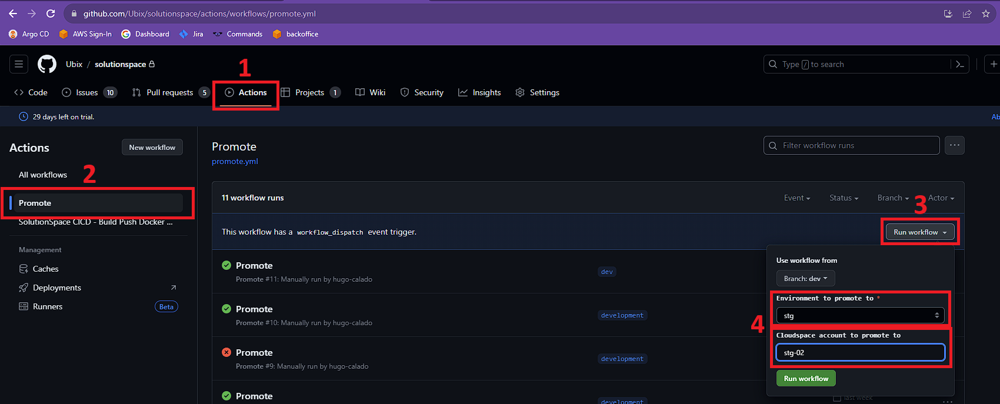

# github-actions-workflows

## Promote

The promote workflow consists of 2 job types, build which can vary depending on the application and update the env which uses the `promote-update-tag.yml`

### Usage

The promote workflow can be manually triggered on the application repos by (see image):
1. Select 'Actions' tab
2. Select the 'Promote' worfklow
3. Click on 'Run Workflow'
4. Fill in the inputs (check next section)



#### Inputs

- Backoffice Applications:
    1. `Environment to promote to` - Selects either stg or prd env to update the application in.
- Cloudspace Applications:
    1. `Environment to promote to` - Selects dev, stg or prd env to update the application in.
    2. `Cloudspace account to promote to` [optional] - Selects which cloudspace account to update, if not filled will update all accounts on the selected env.

### Adding Promote to a repo/branch

You can use as reference any workflow from `Examples` section.

Promote workflow lives in the repos as `.github/workflows/promote.yml` and is configured as follows:

- Inputs
    |                    | type          | required      | application              |
    | -------------      |:-------------:|:-------------:|:------------------------:|
    | environment        | choice        | true          | backoffice and cloudspace|
    | cloudspace_account | string        | false         | cloudspace               |

- Jobs
    |                    |usage                          | application              |
    | -------------      |:-----------------------------:|:------------------------:|
    | call-ci-workflow   | builds image                  | backoffice and cloudspace|
    | tag-docker-image   | updates application image tag | backoffice and cloudspace|

     - call-ci-workflow : Varies depending on the application, common case is to use `Ubix/github-actions-workflows/.github/workflows/main.yml@main` setting up `role-to-assume` and `ECR_REPOSITORY`
 
     - tag-docker-image : Uses `Ubix/github-actions-workflows/.github/workflows/promote-update-tag.yml@main` options:
        1. `environment` - Gets from input the env 
        2. `service` - Application naming (must match what is configured on values.yaml)
        3. `tag` - Gets from call-ci-workflow job
        4. `values-path` - Folder structure that contains the values.yaml file
        5. `base-path` - Base folder where to look for the values.yaml ('Backoffice' or 'Cloudspace/overlays')
        6. `tag-path` - Path configured inside values.yaml to the tag (Usually is "deployment.image.tag")
        7. `cloudspace_account` [cloudspace only] - Gets from input cloudspace_account

### Examples
- Backoffice Application: https://github.com/Ubix/account-management-backend/blob/master/.github/workflows/promote.yml
- Cloudspace Application: https://github.com/Ubix/solutionspace/blob/dev/.github/workflows/promote.yml

### Workflows Usage

CI Custom Build

For Regular Images 
```yaml
call-ci-workflow:
    uses: Ubix/github-actions-workflows/.github/workflows/ci-custom-build.yaml@v2
    needs: authorize
    with:
      role-to-assume: arn:aws:iam::882490700787:role/modelspace-ghactionsopenid
      ECR_REPOSITORY: modelspace
      environment: dev # staging | dev | production (OPTIONAL, default to production)
      enable_trivy: true # If true, trivy step will be executed (OPTIONAL, default to false)
      dockerfile-path: .
      DOJO_URL: "https://security-console.schub.cloud/api/v2/import-scan/"
      build-args: | # It needs to be a multiline argument with each argument in each line
        arg1=value1
        arg2=value2
        arg3=value3
    secrets:
      AUTH_HEADER: ${{ secrets.AUTH_HEADER }}
```

For Huge Images
```yaml
call-ci-workflow:
    uses: Ubix/github-actions-workflows/.github/workflows/ci-custom-build.yaml@v2
    needs: authorize
    with:
      role-to-assume: arn:aws:iam::882490700787:role/modelspace-ghactionsopenid
      ECR_REPOSITORY: modelspace
      environment: dev # staging | dev | production (OPTIONAL, default to production)
      enable_trivy: true # If true, trivy step will be executed (OPTIONAL, default to false)
      dockerfile-path: .
      DOJO_URL: "https://security-console.schub.cloud/api/v2/import-scan/"
      runner: self-hosted
      cache-type: local
    secrets:
      AUTH_HEADER: ${{ secrets.AUTH_HEADER }}
```

### Workflow Release Process

Everytime we make any changes in any workflow, we need to create a new release with a specific tag for that version:

1 - Merge your PR\
2 - Create a new release following the pattern `vN` (eg.: v1, v2, v3, v...)\
3 - Then we need to update the [doc](https://github.com/Ubix/github-actions-workflows?tab=readme-ov-file#workflows-usage) to set this new version for every workflow in the repository

eg.:
```yaml
uses: Ubix/github-actions-workflows/.github/workflows/ci-custom-build.yaml@v1
# or
uses: Ubix/github-actions-workflows/.github/workflows/ci-custom-build.yaml@v2
```
